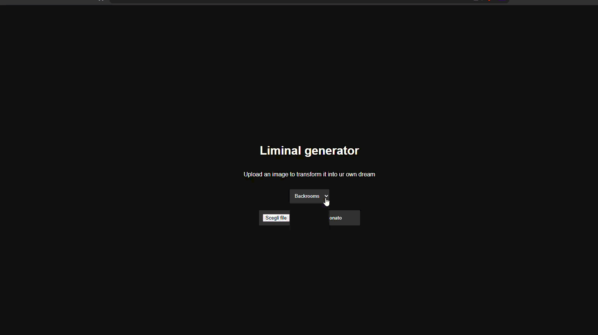

# LiminalGenerator
A web-based image processing engine that transforms ordinary photos into eerie, nostalgic, and surreal art. Inspired by the backrooms movie i watched recently and the popular fandom.

Example on how it works:

### How to use it? 
You can either download the HTML file and open it with a browser or just by using the demo in this website 
> ### [TRY HERE](https://liminal-generator.vercel.app/)
### How does it work?
- I started with making a simple HTML page adding a input for files.
- Using js i made different functions like applyYellowGradiant, desaturate.. that change the imagedata of the image that was sent.
- I inspired myself looking at the usual pattern that liminal/backrooms pictures have (not all of them have this exact same colors).
### Why did i build it?
I built this to learn image manipulation and expand my skills in js/html and of course as stated before i built it because i loved the backrooms movie, this is a little project i am doing for Beest.
### What did i learn doing this and what can YOU learn from the code?
before all of this i didn't know much about image manipulation or canvas theyreself, with documentation and the help of many websites i learned how to manipulate the RGB and found out you can do a lot more than just changing the color of images, by finding out i can make noise change brightness saturation ecc. only by changing the RGBs, the hardest thing to figure out had to be the various loops since the whole thing wasn't getting onto me and i took a while to figure it out.
